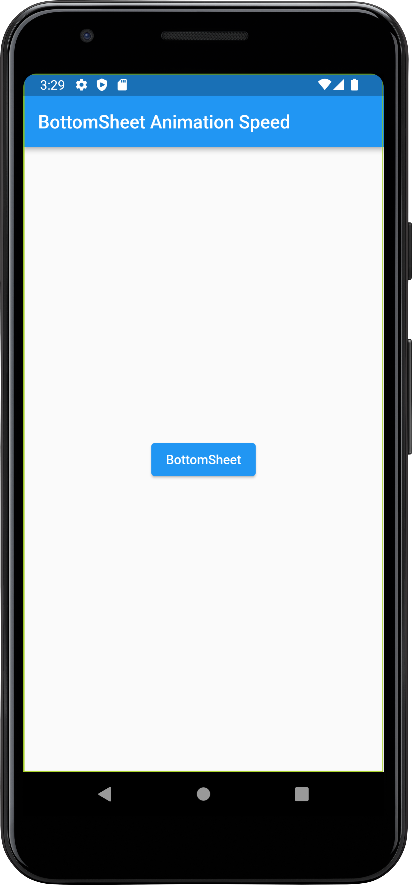
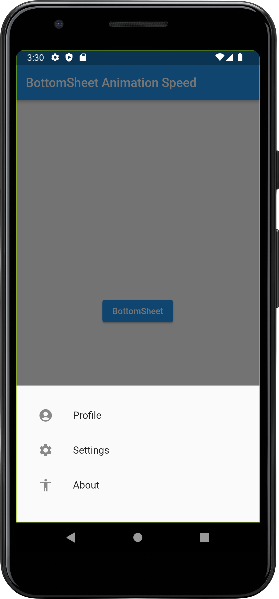
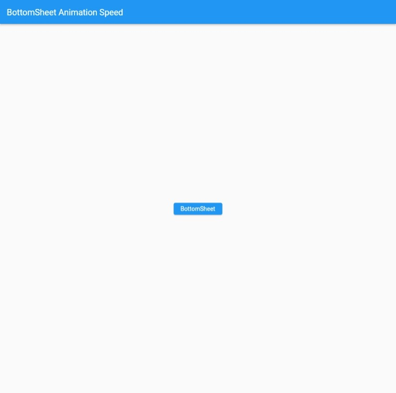
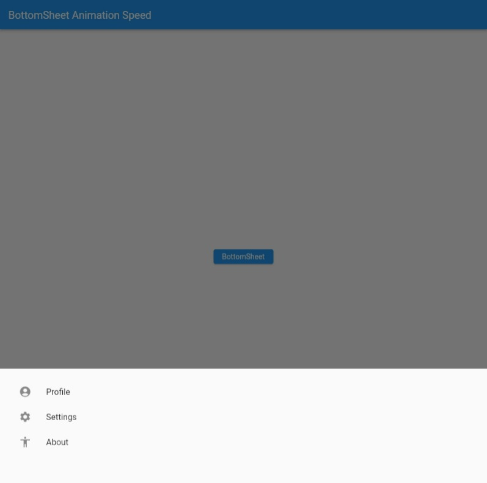

# Bottom Sheet 
This is an Practice app of Flutter Bottom Sheet.

### Download App:

Link: https://terabox.com/s/1Fins8-MGYq1onzcSKXaObw

### Live Site:

Link: https://cpad-gazipur.github.io/Bottom-Sheet/

### Screenshots:

| Home Screen      |  BottomSheet Screen | 
| :---:       |    :----:   | 
|        |       |

| Web Home Screen      |  Web BottomSheet Screen | 
| :---:       |    :----:   | 
|        |       |

### Disclaimer
This project is made only for educational purpose. Anyone can use it but the risk has to be taken by the user.
for any query please contact me.

### Repository Owner Info

### Md. Al-Amin
##### Junior Software Engineer (Android & iOS) at Rokomari.com

__Email :__ [ alamin.karno@outlook.com ](mailto:alamin.karno@outlook.com)  
__Github :__ [Md. Al-Amin](https://github.com/karno786) 
__Facebook :__ [মোঃ আল-আমিন খন্দকার কর্ণ](https://facebook.com/alamin.kanro786)  
__Linkedin :__ [Md. Alamin Karno](https://www.linkedin.com/in/alaminkarno/)
 